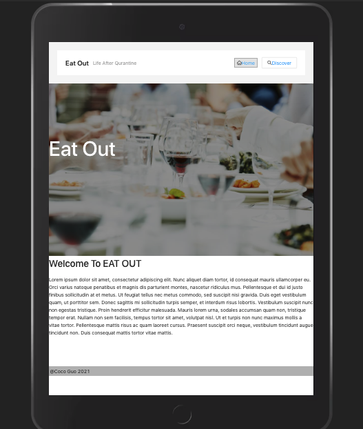
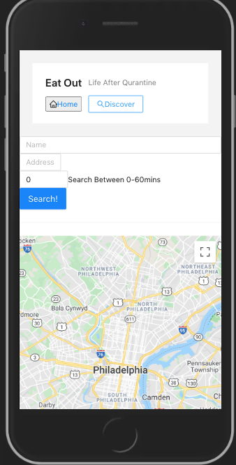

## Table of contents
* [General info](#general-info)
* [Technologies](#technologies)
* [Setup](#setup)

## General info
This project helps users set their location on the mao and search for resturants within 60 mins driving range
* For best result, please run this locally
* You can see the deployed project here https://sg977.github.io/urbn-project/

## Technologies

Project is created with:
* react
* react-dom
* react-router-dom
* react-scripts
* google-map-react
* Google API (Places, Maps Javascript, Geocoding, and Directions)
* gh pages
	
## Setup
To run this project, install it locally using npm:

```
$ clone the repo
$ cd project
$ npm install
$ npm start
```

## Future Improvements 
* Google autocomplete was a struggle, I could have done more research about it
* Add API server side rendering
* Too many google api libraries for me to handle, app is not fully functional
* Break out Discover.js, file got too big, and I had hard time namaging state
* First time using Antd, it was a lot of fun, but I'd like to put more customization into the app
* gh pages was easy to deploy, but I am not sure if it's the best way. May try firebase, Heroku
